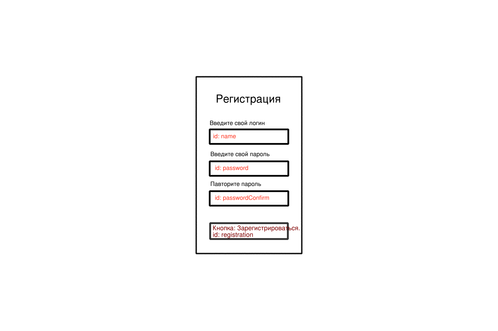
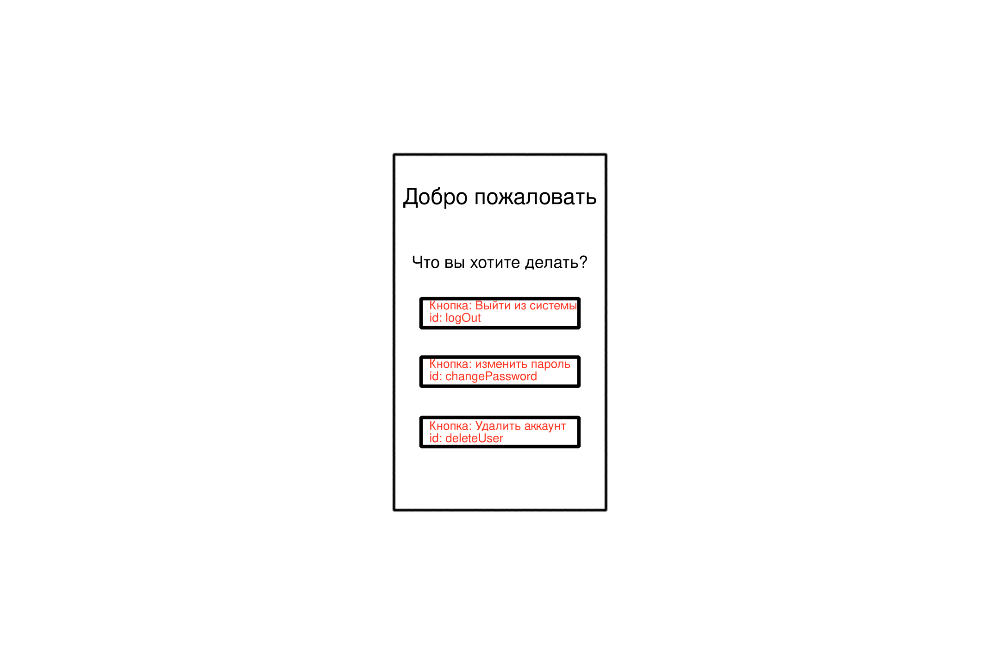
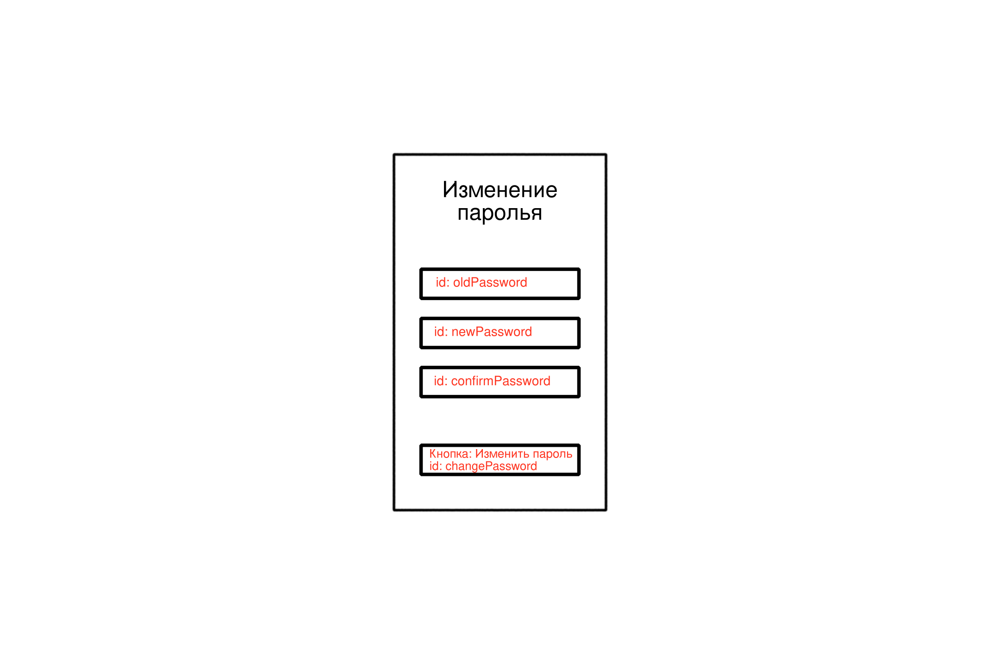
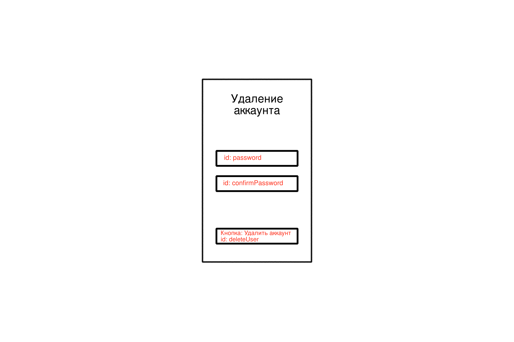

### План макетов страниц для Верстальщиков:






### План HTTP-запросов для JavaScript-разработчиков

#### 1. Вход (Login)
- **Метод**: POST
- **URL**: `/login`
- **Описание**: Вход пользователя в систему.
- **Тело запроса**:
  ```json
  {
    "username": "string",
    "password": "string"
  }
  ```
- **Ответы**:
  - Успех: `200 OK` (Вход успешен, куки с идентификатором сессии установлены)
  - Ошибка: `401 Unauthorized` (Неверный логин или пароль. Добавим строку "Регистрация" под кнопкой войти как в ВК)

#### 2. Регистрация (Signup)
- **Метод**: POST
- **URL**: `/signup`
- **Описание**: Создание нового пользователя.
- **Тело запроса**:
  ```json
  {
    "username": "string",
    "password": "string"
  }
  ```
- **Ответы**:
  - Успех: `201 Created` (Пользователь успешно создан)
  - Ошибка: `400 Bad Request` (Пользователь уже существует)


#### 3. Изменение пароля (Change Password)
- **Метод**: PUT
- **URL**: `/change-password`
- **Описание**: Изменение пароля пользователя.
- **Тело запроса**:
  ```json
  {
    "oldPassword": "string",
    "newPassword": "string"
  }
  ```
- **Заголовки**:
  - `Content-Type: application/json`
  - Куки с идентификатором сессии
- **Ответы**:
  - Успех: `200 OK` (Пароль успешно изменен)
  - Ошибка: `400 Bad Request` (Старый пароль неверен)
  - Ошибка: `401 Unauthorized` (Пользователь не авторизован)

#### 4. Удаление аккаунта (Delete Account)
- **Метод**: DELETE
- **URL**: `/delete-account`
- **Описание**: Удаление аккаунта пользователя.
- **Заголовки**:
  - Куки с идентификатором сессии
- **Ответы**:
  - Успех: `200 OK` (Аккаунт успешно удален)
  - Ошибка: `401 Unauthorized` (пользователь не авторизован)

#### 5. Выход (Logout)
- **Метод**: POST
- **URL**: `/logout`
- **Описание**: Выход пользователя из системы.
- **Заголовки**:
  - Куки с идентификатором сессии
- **Ответы**:
  - Успех: `200 OK` (Выход успешен, сессия завершена)
  - Ошибка: `401 Unauthorized` (пользователь не авторизован)

